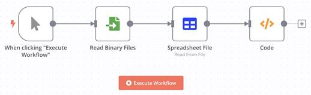

# Ed-Fi Platform as a Service (iPaaS) Proof Of Concept (POC)

## Deployed environment details

| Application/Tech | Version |
| ---------------- | ------- |
| n8n              | 1.14.21 |
| ODS/API          | 6.12    |
| Docker desktop   | 4.22.0  |

## Summary

Research and implement an iPaaS POC for the Ed-Fi ODS/API, with the goal of fully automating different processes making aPI calls.

## Delivered files

Workflows

- read_csv_verify_first_and_last_name_then_GET	demo_2_0.json
- read_csv_and_validate_fields	demo_2_1.json
- json_with_extra_properties_validation_check_test	demo_2_2.json
- json_with_missing_properties_validation_check_test	demo_2_3.json
- json_with_missing_properties_validation_check_test	demo_2_4.json

Sample Comma Separated Values (CSV) files:

- substrings.csv
- regex-test.csv
- json-validate-extra-properties.csv
- Json-validate-missing-properties.csv

## Loading a n8n workflow

### Step 0

Make sure you have a working n8n [local
installation](https://docs.n8n.io/hosting/installation).

### Step 1

Log into the n8n local site: http://localhost:5678/signin


### Step 2

Upon successful login, select "Workflows" from the left panel, and click on "Add Workflow" button


### Step 3

From the right hand side click on the three dots, and select "Import from File"


### Step 4

Navigate to the workflow file location and open it, depending on the side of the workflow you might need to zoom in/out


### Step 5

Verify that the CSV file for the workflow is available (using demo 2.0 as the example):

- Double click on the "Read Binary Files" node.\
  
- This will open the node properties, fill them out with the needed/actual values:\
  
- Configure any node that will access the ODS/API with the proper credentials, in this case, we need the credentials for the GET API request:

| Property                            | Value                                                                     |
| ----------------------------------- | ------------------------------------------------------------------------- |
| Method                              | GET                                                                       |
| URL                                 | https://localhost:443/api/data/v3/ed-fi/students                          |
| Authentication                      | Generic Credential Type                                                   |
| Generic auth Type                   | OAuth2 API                                                                |
| Credential for OAuth2 API           | <see below/after table for value>                                         |
| Send Query Parameters               | ON                                                                        |
| Specify Query Parameters            | `?offset=0&limit=25&totalCount=false&lastSurname={{ $json.lastSurname }}` |
| Send Headers                        | ON                                                                        |
| Specify Headers                     | `accept: application/json`                                                |
| Send Body                           | OFF                                                                       |
| Options:                            |                                                                           |
| Ignore SSL Issues                   | ON                                                                        |
| Include Response Headers and status | ON                                                                        |
| Never Error                         | OFF                                                                       |
| Response Format                     | Autodetect                                                                |

- Credential for OAuth2 API:\
  
- Click on the drop down menu and select "Create New Credentials". These
  credentials come from the ODS/API deployment (in our case local:
  https://localhost/admin) by creating a new pre-populated Application Sample.
- Fill the values out, in the picture below you can see our actual connection details\
  
- Once a name has been specified for these credentials, they can be selected the
  from the drop down menu for any node that needs them for API calls.
- Go back to the n8n Canvas
- This process must be carried out when importing workflows (demos) that use CSV files and access the ODS/API.

## Demo 2.0: Conjoined values

- CSV file: substrings.csv
- Workflow: read_csv_verify_first_and_last_name_then_GET__demo_2_0.json
- Use cases:
  - Missing "firstName" parameter, both "firstName" and "lastSurname" in "lastSurname value
  - Missing "lastSurname" parameter, both "lastSurname" and "firstName" in "firstName" value
  - All needed values present
  - Missing "firstName"
  - Missing "lastSurname"

Load the workflow as described in Loading a n8n workflow and execute the workflow:


Once the workflow has been executed you can see the inputs and outputs of each node, to verify and confirm the resulting output of the workflow, please double click on the rightest node "Merge1" and you should see an output of 5 items coming from the ODS/API

The picture below shows a successful execution of the workflow:


## Demo 2.1: Conjoined values, sanitizing

- CSV file: regex-test.csv
- Workflow: read_csv_and_validate_field__demo_2_1.json
- Use cases:
  - year missing, year and district_no both in district_no
  - district_no missing, year and district_no both in year
  - year with extra no numeric characters
  - district_no with extra no numeric characters
  - district_name missing
  - district_no with extra numeric characters

Load the workflow as described in Loading a n8n workflow and execute the workflow:


The picture below shows a successful execution of the workflow:


## Demo 2.2: Check for extra properties

- CSV file: json-validate-extra-properties.csv
- Workflow: json_with_extra_properties_validation_check_test__demo_2_2.json
- Use cases: extra property "age"

Load the workflow as described in Loading a n8n workflow and execute the workflow:


The picture below shows a successful execution of the workflow:


The workflow output can be verified by double clicking the Code node, this
output is not very helpful for the use case since it outputs the same values as
the given input but if the browser tools (Web developer tools) are open, in the
Console the needed information can be found:


As it can be seen in the picture above the the very first item of the CSV file
is displayed in the second line as:

```none
[Node: "Code"] {‘firsName’: ‘Dale’, ‘lastSurname’: ‘Jimenez’, ‘age’: ‘23’}
```

And it contains an extra property "age" that is not part of the intended schema.

## Demo 2.3: Check for missing properties, no changes

- CSV file: json-validate-missing-properties.csv
- Workflow: json_with_missing_properties_validation_check_test_demo_2_3.json
- Use cases: property "lastSurname" missing

Load the workflow as described in Loading a n8n workflow and execute the workflow:



The picture below shows a successful execution of the workflow:


The workflow output can be verified by double clicking the Code node, this
output is not very helpful for the use case since it outputs the same values as
the given input but if the browser tools (Web developer tools) are open, in the
Console the needed information can be found:


As it can be seen in the picture above the very first item of the CSV file is
displayed in the second line as:

```none
[Node: "Code"] {‘lastSurname’: ‘Jimenez’}
```

And is missing the "firstName" property which is part of the intended schema.

## Demo 2.4: Check for missing properties, custom output

- CSV file: json-validate-missing-properties.csv
- Workflow: json_with_missing_properties_validation_check_test_demo_2_4.json
- Use cases: property "lastSurname" missing

This demo is just a variant of the Demo 2.3: Check for missing properties, no
changes one. In the Demo 2.3 the node receives an input and then delivers it as
output, not doing any changes, but identifying/displaying in the console
(browser developer tools) if a required property is missing.

In this demo (2.4), the node receives an input but instead of displaying a message to the console if a required property is missing, it actually creates an output stating the issue for the subsequent nodes to process in whatever way they might need to.

Load the workflow as described in Loading a n8n workflow and execute the workflow:


The picture below shows a successful execution of the workflow:


Notice the output on the last node ("Code") of just one item, as opposed to the
output on Demo 2.3: Check for missing properties, no changes of 4 items.

Double clicking on the node "Code" will show the input delivered from the node
"Spreadsheet file" and its output once it was processed:

| 'Code' node Input | 'Code' node Output |
| -- | -- |
|  |  |
